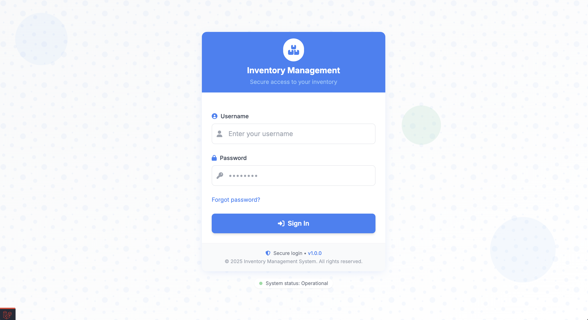
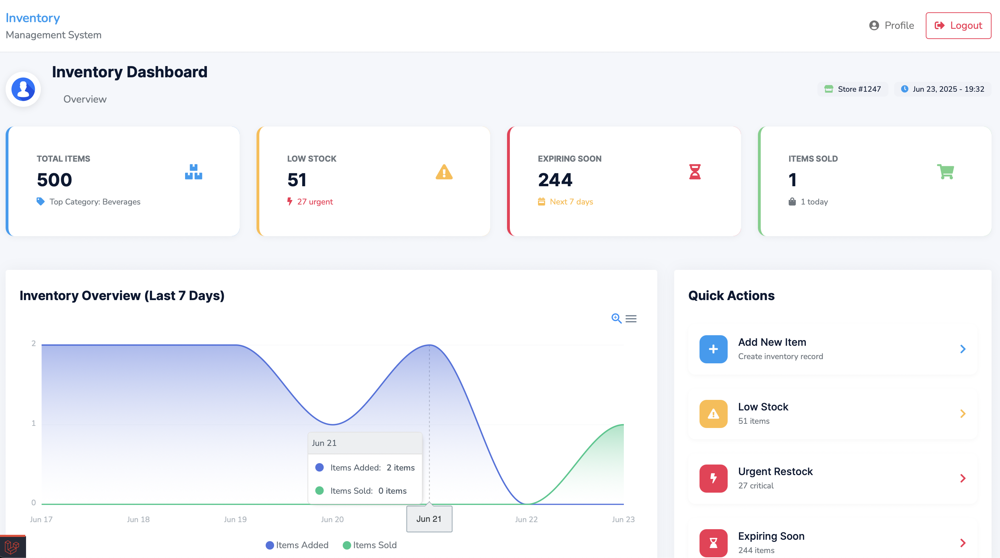
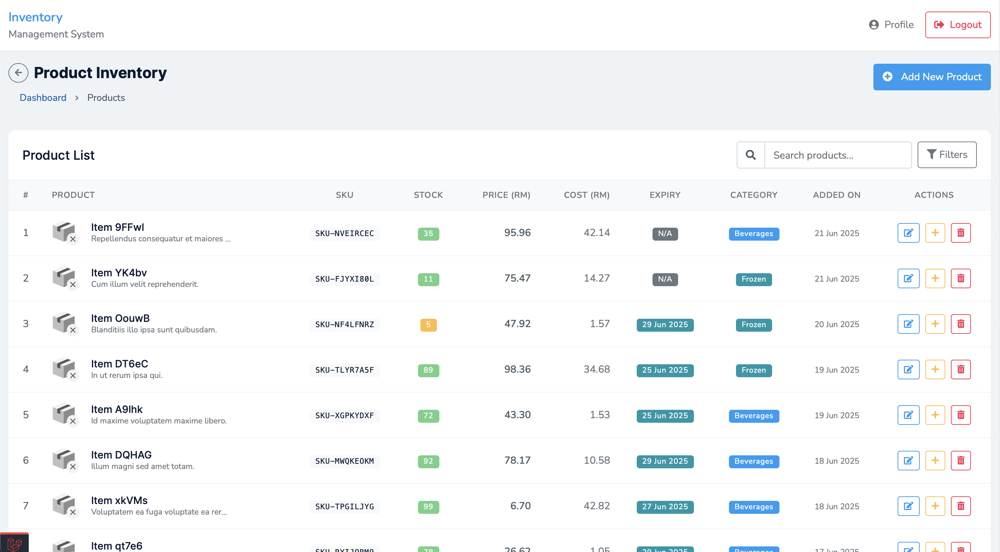
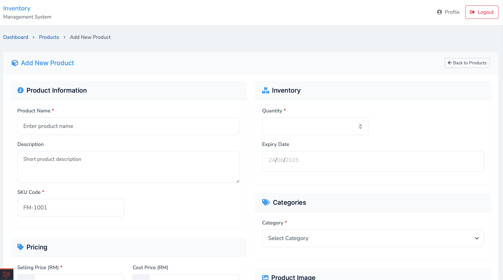

# My Inventory Management System

This is a web-based **Inventory Management System** built using **Laravel** and **MySQL**. It allows users to manage products with ease, track inventory, and visualize performance through interactive charts. The system supports user authentication, stock tracking, and data export features.

---

## Features

### Authentication & Profile
- User Registration & Login
- Forgot Password & Reset via Email
- Profile Page to Update:
  - Username
  - Email
  - Password

### Inventory Management
- Add, Edit, and Delete Items/Products
- Restock Low Stock Items via Popup Form
- Track Item Expiration Dates

### Dashboard
- Total Items
- Low Stock
- Expiring Soon
- Items Sold
- Interactive Chart to View Sold & Received Items
- Export Chart as:
  - PNG
  - SVG
  - CSV

---

## Built With

- **PHP** (Laravel Framework)
- **MySQL** – Database
- **Tailwind CSS** – Login & Register Pages
- **Bootstrap** – Main UI Pages
- **HTML**, **CSS**, **JavaScript**

---

## Screenshots

### Login Page


### Dashboard


### Product List


### Add New Item


---

## Getting Started

### Prerequisites

- PHP >= 8.1
- Composer
- MySQL

---

### 🛠 Installation

1. **Clone the Repository**

```bash
git clone https://github.com/MuhammadZulhusni/My-Inventory-Management.git
cd My-Inventory-Management
```

2. **Install PHP Dependencies**

```bash
composer install
```

3. **Copy .env and Generate App Key**

```bash
cp .env.example .env
php artisan key:generate
```

4. **Configure .env with Your Database Info, then run**
```bash
php artisan migrate
```

5. **Install Node Dependencies and Compile Assets**
```bash
npm install
npm run dev
```

6. **Run the App**
```bash
php artisan serve
```
